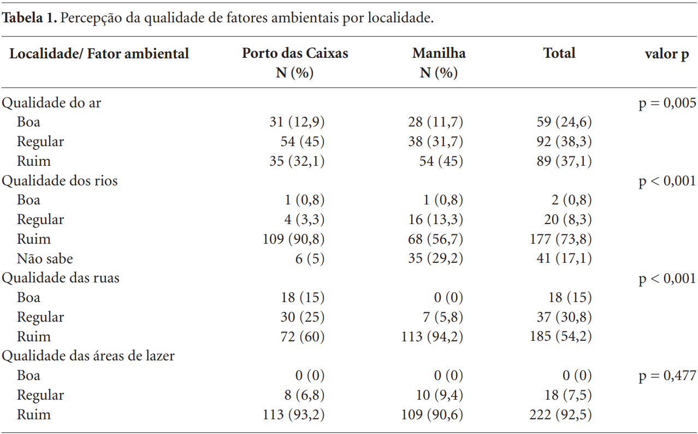
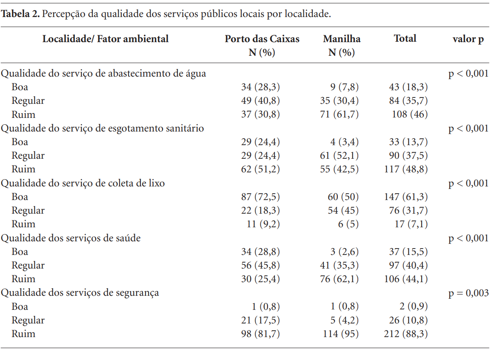

# **CAPÍTULO 1** {data-background-image="Capa.png" style="text-align:center"}

## **Percepção da qualidade ambiental de localidades próximas ao complexo Petroquímico do Rio de Janeiro, Brasil** 

**Autores:** Marcela de Abreu Moniz, Cleber Nascimento do Carmo, Sandra de Souza Hacon.

**Motivação:** Compreender como os moradores percebem a qualidade ambiental dos locais onde vivem por conta do Complexo Petroquímico do Rio de Janeiro (COMPERJ). Isso pode contribuir para o planejamento de ações e políticas públicas voltadas à promoção da saúde e à questões ambientais.

---

**Objetivo:** Verificar a diferença da percepção de residentes sobre a qualidade ambiental de duas localidades próximas à área de construção do Complexo Petroquímico do Rio de Janeiro (COMPERJ)

---

**Método de coleta:** Foi realizado um estudo transversal com 240 residentes do município de Itaboraí, sendo 120 do distrito de Porto das Caixas e 120 de Manilha. A amostra foi obtida via amostragem aleatória simples, sem reposição, a partir de um censo de alunos matriculados nas escolas locais, aplicando questionários aos responsáveis por esses estudantes.

# **CAPÍTULO 2**{data-background-image="Capa.png" style="text-align:center"}

## **Variáveis analisadas**

**Fatores de exposição:**

- Localidade (Porto das Caixas e Manilha)
- Fatores ambientais (ar, rios, ruas, lazer)
- Serviços públicos (água, esgoto, lixo, saúde, segurança)

**Desfecho:**

- Percepção da qualidade ambiental (boa, regular, ruim)

---

## **Testes de associação**

- Teste Qui-quadrado de independência  
- Teste Exato de Fisher  

**Critério de decisão:**

::: box-blue
p < 0,05 → associação significativa
:::

# **CAPÍTULO 3**{data-background-image="Capa.png" style="text-align:center"}

---

{fig-align="center" width="90%"}

---

{fig-align="center" width="80%"}

---

## **Interpretação**

- Manilha → pior percepção de água, saúde e segurança  
- Porto das Caixas → pior percepção de rios e esgoto  

---

## **Achado relevante**

- 51% dos moradores de Porto das Caixas associaram a piora ambiental a um acidente químico ocorrido em 2005

# **CAPÍTULO 4**{data-background-image="Capa.png" style="text-align:center"}

## **Principais achados**

- Existem diferenças significativas entre as localidades  
- A percepção ambiental varia conforme o contexto local  

---

## **Importância dos testes de associação**

- Permitem identificar diferenças reais entre grupos  
- Transformam dados em evidência científica  

---

## **Contribuição para a sociedade**

- Auxilia na formulação de políticas públicas  
- Ajuda a reduzir problemas ambientais e diferença entre eles  
- Valoriza a percepção da população